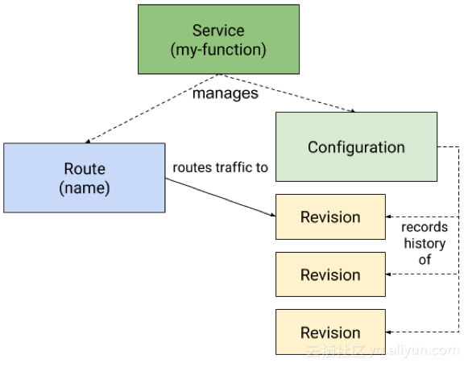

class: center, middle

# Knative 介绍

&nbsp;
&nbsp;

---

## Outline

### 1. 简介

### 2. 核心概念和原理

### 3. 问题和思考

---

## 1. 简介

- 一个让开发者在 k8s 上创建 (build) 和部署 (deploy) serverless 应用的平台

- 2018年7月24日发布

- 一套实现 serverless 的开源方案

- 基于 kubernetes (容器编排引擎) 和 Istio (微服务流量治理)，

- 创建者：Google、Pivotal、IBM、Red Hat


---

## 1. 使用

Knative 的使用者只需：
- 编写代码（或者函数）
- 编写配置文件（如何 build、运行以及访问等声明式信息）
- 使用 Knative build 和 deploy, 就能把应用自动部署到集群

Knative 负责：
- 自动完成代码到容器的构建
- 把应用（或者函数）和特定的事件进行绑定：当事件发生时，自动触发应用（或者函数）
- 网络的路由和流量控制
- 应用的自动伸缩

---

## 1. Serverless > FasS

- Knative 期望支持所有类型的应用


---

## 1. 基于 Kubernetes 和 Istio

- Kubernetes 提供基于 pod 的管理能力：副本管理、弹性伸缩等

- Istio 通过边车容器提供网络管理能力：负载均衡、微服务流量路由等


---

## 2. 核心概念和原理

Knative 由三部分系统组成：

- Building: 构建系统，把用户定义的函数和应用 build 成容器镜像

- Serving：服务系统，用来配置应用的路由、升级策略、自动扩缩容等功能

- Eventing：事件系统，用来自动完成事件的绑定和触发


---

## 2.1 Building

- 构建完成是在 kubernetes 中进行的，和整个 kubernetes 生态结合更紧密

- 旨在提供一个通用的标准化的构建组件，可以作为其他更大系统中的一部分。

- 为了定义标准化、可移植、可重用、性能高效的构建方法


---

## 2.1 Building

Knative 提供了 Build CRD 对象，让用户可以通过 yaml 文件定义构建过程。一个典型的 Build 配置文件如下
```
apiVersion: build.knative.dev/v1alpha1
kind: Build
metadata:
  name: kaniko-build
spec:
  serviceAccountName: build-bot
  source:
    git:
      url: https://github.com/my-user/my-repo # 需存在 DockerFile 文件 
      revision: master
  template:
    name: kaniko
    arguments:
    - name: IMAGE
      value: us.gcr.io/my-project/my-app
```
部署后会自动 pull 代码并 build 镜像

---

## 2.2 Serving：功能

Serving 提供的功能：

- 请求驱动的计算运行时

- 支持 Scale to 0 / 按负载 scale out 

- 同一个应用可有多个修订版本 (revision)

- 动态分配路由流量到不同的修订 (revision)

- 支持蓝绿发布、回滚

---

## 2.2 Serving：概念

- **Configuration**：应用的最新配置，也就是应用目前期望的状态，对应了 kubernetes 的容器管理（deployment）。每次应用升级都会更新 configuration，而 knative 也会保留历史版本的记录（图中的 revision），结合流量管理，knative 可以让多个不同的版本共同提供服务，方便蓝绿发布和滚动升级

- **Route**：应用的路由规则，也就是进来的流量如何访问应用，对应了 istio 的流量管理（VirtualService）

- **Service**：注意这里不是 kubernetes 中提供服务发现的那个 service，而是 knative 自定义的 CRD，它的全称是 services.serving.knative.dev 。



---

## 2.2 Serving：例子

使用 serving 需要定义一个 Service 对象，如下为一个例子的 yaml 文件
```
apiVersion: serving.knative.dev/v1alpha1
kind: Service
metadata:
  name: helloworld-go
  namespace: default
spec:
  runLatest:
    configuration:
      revisionTemplate:
        spec:
          container:
            image: docker.io/{username}/helloworld-go
            env:
            - name: TARGET
              value: "Go Sample v1"
```

---

## 2.2 Serving: 通过配置 Route 对象控制路由策略

```
apiVersion: serving.knative.dev/v1alpha1
kind: Route
metadata:
  name: knative-routing-demo
  namespace: default
spec:
  traffic:
  - revisionName: knative-routing-demo-00001
    name: v1
    percent: 50
  - revisionName: knative-routing-demo-00002
    name: v2
    percent: 50
```


---

## 2.2 Serving: 原理


- 每个 revision 对应了一组 deployment 管理的 pod
- pod 会自动汇报 metrics 数据到 autoscaler，autoscaler 会根据请求量和资源使用情况修改 deployment 的 replicas 数量，从而实现自动扩缩容
- 当应用没有流量访问时，它会自动销毁所有的 pod，实现 scale to 0
- 当某个 revision 后面的 pod 缩容到 0 时，route 的流量会指向 activator，activator 接收到请求之后会自动拉起 pod，然后把流量转发过去

---

## 2.3 Eventing

- serverless 最重要的是基于事件的触发机制，也就是说当某件事发生时，就触发某个特定的函数。

- 事件概念的出现，让函数和具体的调用方能够解耦。函数部署出来不用关心谁会调用它，而事件源触发也不用关心谁会处理它。

- 目前 serverless 的产品和平台很多，每个地方支持的事件来源以及对事件的定义都是不同的（比如 AWS Lambda 支持很多自己产品的事件源）。 Knative 也在推进事件标准化的工作，也就是 CNCF 旗下的项目————CloudEvents。

---

## 2.3 Eventing：概念

- **EventSource**：事件源，能够产生事件的外部系统

- **Feed**：把某种类型的 EventType 和 EventSource 和对应的 Channel 绑定到一起

- **Channel**：对消息实现的一层抽象，后端可以使用 kafka、RabbitMQ、Google PubSub 作为具体的实现。channel name 类似于消息集群中的 topic，可以用来解耦事件源和函数。事件发生后 sink 到某个 channel 中，然后 channel 中的数据会被后端的函数消费

- **Subscription**：把 channel 和后端的函数绑定的一起，一个 channel 可以绑定到多个knative service

---

## 2.3 Eventing：整体流程


---

## 2.3 Eventing：整体流程

- Bus 是 knative 内部的事件存储层，用户可以选择自己感兴趣的实现，目前支持的方式有：Stub（在内存中实现的简单消息系统）、Kafka、Google PubSub。如果想要事件能够正常运行，必须在 knative 集群中安装其中一个 bus 实现方式。

- 目前支持的事件源有三个：github（比如 merge 事件，push 事件等），kubernetes（events），Google PubSub（消息系统），后面还会不断接入更多的事件源。

-  source adaptor 是在 knative 中部署的一个 pod，它负责从外部的系统中读取事件，完成对外部事件源的监听。

- 读取后的事件，会根据用户配置的 Feed 对象（里面包括了事件源和 channel 的对应关系），找到对应的 channel，然后把消息发送到这个 channel 中（channel 的消息最终是存储在后端的 bus 系统里的）。

- 最后，knative 会根据 subscription 的配置，不断从 channel 中读取事件，然后把事件作为参数调用对应的函数，从而完成了整个事件的流程。

---

## 3. 问题和思考：Knative 目前的状态

- Knative 是 2018年7月 才发布，还是比较年轻的项目，版本号只到 v0.11，没有发布正式版。

- 社区也较为活跃，过去一个月约有 39个 issue，36 个 pull request，合并了25个。

---

## 3. 问题和思考：Knative 的问题

- 性能：控制链路太长，容器启停需要额外的时间，难以满足高并发、高性能的要求。

- 依托 kubernetes 和 Istio 这两个较高复杂度的系统，自身也提出了新概念，增加了系统复杂度，给整个系统运维带来挑战。

- pod 的伸缩不一定能完全满足性能指标的要求。

- 缺少成本与性能的协调。

总的来说，Knative 提供了一种简单可用的 Serverless 落地方案，利用它可以实现 FasS 等 Serverless 计算模式。
但这一方案还明显非常初级和原型的，最终的 Serverless 实现模式和使用平台，也不一定就是 Knative。
