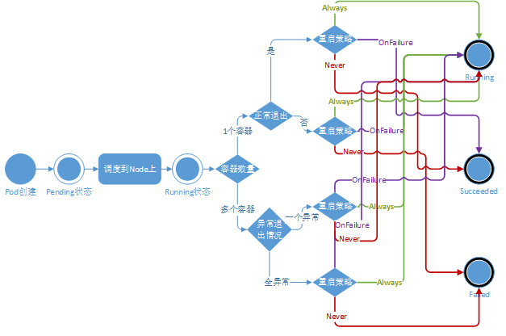
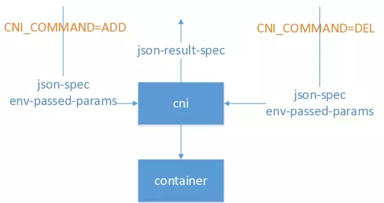
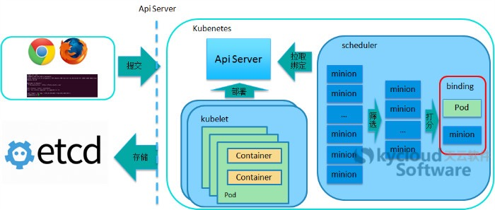
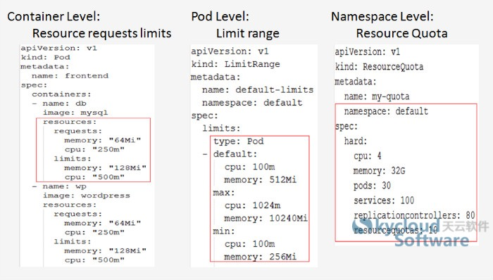

class: center, middle

# Kubernetes介绍

&nbsp;
&nbsp;

#### 朱瑜坚  

---

## Outline

### <font color="orangered">1. 简介</font>

### 2. 核心概念，功能特性

### 3. 网络

### 4. 调度

---

## 1. 简介

- Kubernetes是一个在集群主机间进行自动化部署、扩展和容器操作的提供以容器为中心基础设施的开源平台。

- Kubernetes始于Google 2014 年的一个项目。

- 面向微服务应用场景

特点：

- 可移植: 支持公有云，私有云，混合云，复合云

- 可扩展: 模块化，热插拨，可组合

- 自愈: 自动替换，自动重启，自动复制，自动扩展

---

### 1.1 功能简介

- 存储系统挂载

- 应用健康检测

- 应用实例复制

- 水平自动扩展

- 命名和发现

- 负载均衡

- 滚动更新

- 资源监控

- 日志访问

- 自检和调试

- 识别和认证

---

### 1.2 安装和配置

Kubernetes中提供了比较多的安装和配置方案：

- 独立方案

	- 使用minikube(能创建一个单节点的，本地的kubernetes集群，安装配置是全自动的)

	- 使用kubeadm进行安装配置(多节点的自动部署方案)

	- 使用conjure-up安装配置（ubuntu方案，一键式配置，用于生产环境，会下载比较多镜像）
	
	- *传统方法（分别下载所需组件，逐个进行配置，官方文档中没有这种方法）

- 托管方案

	- Google Container Engine
	
	- IBM Blumix Container Service
	
	- ...

- 一站式云方案

	- On Google Compute Engine

	- On AWS EC2
 
	- On Alibaba Cloud(阿里云)
	
	- ...
---

### 1.3 Kubeadm的安装方案

- Kubeadm是一个多节点的Kubernetes的安装部署器，只需要提前安装好docker daemon。它会在每个node上为每个组件建立相应的docker并pull相应的镜像。然后用docker-in-docker技术部署安装kubernetes集群。

步骤：

- 下载安装kubeadm，kubelet，kubectl, kubernetes-cni

- 使用kubeadm在master上init： init后自动安装和启动相应组件

- 安装配置网络方案插件(kubectl apply -f ...，比如flannel,calico)

- 在每个node上使用kubeadm join： join后自动安装和启动相应组件

---

## 2.核心概念

- node & components

- architecture

- pod

- Controller:

	- Replication Controller

	- job

	- deployment
	
	- StatefulSets
	
	- Daemon Sets

- service

- volume

---

## 2.1 Node & Components

- Master: 是一台机器（物理机或虚拟机），其上运行着负责在集群中管理、启动所有kubernetes服务的组件。

- Node: 一个node是台机器（物理机或虚拟机）。每个Node上会运行pods，并接受Master上的组件的管理。


---

## 2.1 Node & Components

### Components on Master:

- kube-apiserver: apiserver负责对外提供RESTful的Kubernetes API服务，它是系统管理指令的统一入口，任何对资源进行增删改查的操作都要交给apiserver处理后再提交给etcd。kubectl（Kubernetes提供的客户端工具，该工具内部就是对Kubernetes API的调用）是直接和APIServer交互的。

- etcd: etcd是一个高可用的键值存储系统，Kubernetes使用它来存储各个资源的状态。

- kube-controller-manager: 每个资源一般都对应有一个控制器，而controller manager就是负责管理这些控制器的。比如我们通过APIServer创建一个pod，当这个pod创建成功后，apiserver的任务就算完成了。而后面保证Pod的状态始终和我们预期的一样的重任就由controller manager去保证了。

- kube-scheduler: scheduler的职责很明确，就是负责调度pod到合适的Node上。如果把scheduler看成一个黑匣子，那么它的输入是pod和由多个Node组成的列表，输出是Pod和一个Node的绑定，即将这个pod部署到这个Node上。Kubernetes目前提供了调度算法，但是同样也保留了接口，用户可以根据自己的需求定义自己的调度算法。

- dns, monitoring, logging, Web UI...

---

## 2.1 Node & Components

### Components on Node:

- kubelet: Kubelet是Master在每个Node节点上面的agent，是Node节点上面最重要的模块，它负责维护和管理该Node上面的所有容器，但是如果容器不是通过Kubernetes创建的，它并不会管理。本质上，它负责使Pod得运行状态与期望的状态一致。

- kube-proxy: 该模块实现了Kubernetes中的服务发现和反向代理功能。反向代理方面：kube-proxy支持TCP和UDP连接转发，默认基于Round Robin算法将客户端流量转发到与service对应的一组后端pod。服务发现方面，kube-proxy使用etcd的watch机制，监控集群中service和endpoint对象数据的动态变化，并且维护一个service到endpoint的映射关系，从而保证了后端pod的IP变化不会对访问者造成影响。另外kube-proxy还支持session affinity。

- runtime: runtime指的是容器运行环境，目前Kubernetes支持docker和rkt两种容器。

- supervisord(monitor and control), fluentd(logging)

---

## 2.2 Architecture


---

## 2.3 Pod

- Pod是Kubernetes的基本操作单元，也是应用运行的载体。整个Kubernetes系统都是围绕着Pod展开的，比如如何部署运行Pod、如何保证Pod的数量、如何访问Pod等。

### 2.3.1 Pod与容器

- Pod包含一个或者多个相关的容器，Pod可以认为是容器的一种延伸扩展，一个Pod也是一个隔离体，而Pod内部包含的一组容器又是共享网络和存储资源的。Pod中的容器可以访问共同的数据卷来实现文件系统的共享。


---

### 2.3.2 镜像

在kubernetes中，镜像的下载策略为：

- Always：每次都下载最新的镜像

- Never：只使用本地镜像，从不下载

- IfNotPresent：只有当本地没有的时候才下载镜像

Pod被分配到Node之后会根据镜像下载策略进行镜像下载，可以根据自身集群的特点来决定采用何种下载策略。无论何种策略，都要确保Node上有正确的镜像可用。

---

### 2.3.3 其他设置

通过yaml文件，可以在Pod中设置：

- 启动命令

- 环境变量

- 端口桥接

- Host网络，一些特殊场景下，容器必须要以host方式进行网络设置（如接收物理机网络才能够接收到的组播流），在Pod中也支持host网络的设置

- 数据持久化

- 重启策略，当Pod中的容器终止退出后，重启容器的策略。这里的所谓Pod的重启，实际上的做法是容器的重建，之前容器中的数据将会丢失，如果需要持久化数据，那么需要使用数据卷进行持久化设置。Pod支持三种重启策略：Always（默认策略，当容器终止退出后，总是重启容器）、OnFailure（当容器终止且异常退出时，重启）、Never（从不重启）；

---

### 2.3.4 Pod生命周期



---

## 2.4 Controller: Replication Controller

- Replication Controller（RC）是Kubernetes中的另一个核心概念，应用托管在Kubernetes之后，Kubernetes需要保证应用能够持续运行，这是RC的工作内容，它会确保任何时间Kubernetes中都有指定数量的Pod在运行。在此基础上，RC还提供了一些更高级的特性，比如滚动升级、升级回滚等。

### 2.4.1 RC与Pod的关联——Label

- RC与Pod的关联是通过Label来实现的。Label机制是Kubernetes中的一个重要设计，通过Label进行对象的弱关联，可以灵活地进行分类和选择。对于Pod，需要设置其自身的Label来进行标识，Label是一系列的Key/value对。

- Label的定义是任一的，但是Label必须具有可标识性，比如设置Pod的应用名称和版本号等。另外Lable是不具有唯一性的，为了更准确的标识一个Pod，应该为Pod设置多个维度的label。

- 修改了对应Pod的Label，就会使Pod脱离RC的控制。同样，在RC运行正常的时候，若试图继续创建同样Label的Pod，是创建不出来的。因为RC认为副本数已经正常了，再多起的话会被RC删掉的。

---


---

### 2.4.2 弹性伸缩

- 弹性伸缩是指适应负载变化，以弹性可伸缩的方式提供资源。反映到Kubernetes中，指的是可根据负载的高低动态调整Pod的副本数量。调整Pod的副本数是通过修改RC中Pod的副本是来实现的。

- 扩容Pod的副本数目到10只需一条指令（缩容也类似）：

	```
	kubectl scale relicationcontroller yourRcName --replicas=10
	```

---

### 2.4.3 滚动升级

- 滚动升级是一种平滑过渡的升级方式，通过逐步替换的策略，保证整体系统的稳定，在初始升级的时候就可以及时发现、调整问题，以保证问题影响度不会扩大。


---

### 2.4.3 滚动升级

- 升级过程中，发生了错误中途退出时，可以选择继续升级。Kubernetes能够智能的判断升级中断之前的状态，然后紧接着继续执行升级。当然，也可以进行回退。


---

### 2.4.4 Replica Set

- 这里所说的replica set，可以被认为 是“升级版”的Replication Controller。也就是说。replica set也是用于保证与label selector匹配的pod数量维持在期望状态。

- 区别在于，replica set引入了对基于子集的selector查询条件，而Replication Controller仅支持基于值相等的selecto条件查询。这是目前从用户角度肴，两者唯一的显著差异。 社区引入这一API的初衷是用于取代vl中的Replication Controller，也就是说．当v1版本被废弃时，Replication Controller就完成了它的历史使命，而由replica set来接管其工作。

- 虽然replica set可以被单独使用，但是目前它多被Deployment用于进行pod的创建、更新与删除。

---

## 2.5 Controller: job

- 从程序的运行形态上来区分，我们可以将Pod分为两类：长时运行服务（jboss、mysql等）和一次性任务（数据计算、测试）。RC创建的Pod都是长时运行的服务，而Job创建的Pod都是一次性任务。

- 在Job的定义中，restartPolicy（重启策略）只能是Never和OnFailure。Job可以控制一次性任务的Pod的完成次数（Job-->spec-->completions）和并发执行数（Job-->spec-->parallelism），当Pod成功执行指定次数后，即认为Job执行完毕。

---

## 2.6 Controller: deployment

- Kubernetes提供了一种更加简单的更新RC和Pod的机制，叫做Deployment。通过在Deployment中描述你所期望的集群状态，Deployment Controller会将现在的集群状态在一个可控的速度下逐步更新成你所期望的集群状态。Deployment主要职责同样是为了保证pod的数量和健康，继承了上面描述的Replication Controller全部功能，可以看做新一代的Replication Controller。
 
但是，它又具备了Replication Controller之外的新特性：

- 事件和状态查看：可以查看Deployment的升级详细进度和状态。

- 回滚：当升级pod镜像或者相关参数的时候发现问题，可以使用回滚操作回滚到上一个稳定的版本或者指定的版本。

- 版本记录: 每一次对Deployment的操作，都能保存下来，给予后续可能的回滚使用。

- 暂停和启动：对于每一次升级，都能够随时暂停和启动。

- 多种升级方案：Recreate----删除所有已存在的pod,重新创建新的; RollingUpdate----滚动升级，逐步替换的策略，同时滚动升级时，支持更多的附加参数，例如设置最大不可用pod数量，最小升级间隔时间等等。

---

## 2.6 Controller: deployment


---

## 2.7 Controller: StatefulSets

- 1.8版本里加入beta版本的StatefulSets。

- RC和RS主要是控制提供无状态服务的，其所控制的Pod的名字是随机设置的，一个Pod出故障了就被丢弃掉，在另一个地方重启一个新的Pod，名字变了、名字和启动在哪儿都不重要，重要的只是Pod总数；而StatefulSet是用来控制有状态服务，StatefulSet中的每个Pod的名字都是事先确定的，不能更改。StatefulSet中Pod的名字的作用，是用来关联与该Pod对应的状态。

- RC和RS中的Pod一般不挂载存储或者挂载共享存储，保存的是所有Pod共享的状态；对于StatefulSet中的Pod，每个Pod挂载自己独立的存储，如果一个Pod出现故障，从其他节点启动一个同样名字的Pod，要挂在上原来Pod的存储继续以它的状态提供服务。

- 适合于StatefulSet的业务包括数据库服务MySQL和PostgreSQL，集群化管理服务Zookeeper、etcd等有状态服务。

- StatefulSet的另一种典型应用场景是作为一种比普通容器更稳定可靠的模拟虚拟机的机制。使用StatefulSet，Pod仍然可以通过漂移到不同节点提供高可用，而存储也可以通过外挂的存储来提供高可靠性，StatefulSet做的只是将确定的Pod与确定的存储关联起来保证状态的连续性。

---

## 2.8 Controller: Daemon Set

- DaemonSet保证全部或者部分Node上都运行着相同的一份pod。当有新node加入，新node上也会自动运行一样的pod。而当node从集群中删除，那些pods会被当垃圾收集掉。

一些典型的应用有：

- 集群存储守护进程，比如glusterd, ceph。

- 日志守护进程，比如fluentd或logstash。

- 监控守护进程。

---

## 2.9 Service

- 为了适应快速的业务需求，微服务架构已经逐渐成为主流，微服务架构的应用需要有非常好的服务编排支持。Kubernetes中的核心要素Service便提供了一套简化的服务代理和发现机制，天然适应微服务架构。

- Kubernetes中的Service是一种抽象概念，它定义了一个Pod逻辑集合以及访问它们的策略，Service同Pod的关联同样是基于Label来完成的。Service的目标是提供一种桥梁，它会为访问者提供一个固定访问地址，用于在访问时重定向到相应的后端，这使得非Kubernetes原生应用程序，在无须为Kubemces编写特定代码的前提下，轻松访问后端。


---

### 2.9.1 Service原理

- 当Service中的Pod发生变化时（增加、减少、重建等），Service会及时更新。这样一来，Service就可以作为Pod的访问入口，起到代理服务器的作用，而对于访问者来说，通过Service进行访问，无需直接感知Pod。

- 需要注意的是，Kubernetes分配给Service的固定IP是一个虚拟IP，并不是一个真实的IP，在外部是无法寻址的。真实的系统实现上，Kubernetes是通过Kube-proxy组件来实现的虚拟IP路由及转发。所以在之前集群部署的环节上，我们在每个Node上均部署了Proxy这个组件，从而实现了Kubernetes层级的虚拟转发网络。

- 更具体的说是通过反向代理和iptables实现的。

### 2.9.2 Service内部负载均衡

- 当Service的Endpoints包含多个IP的时候，及服务代理存在多个后端，将进行请求的负载均衡。默认的负载均衡策略是轮训或者随机（有kube-proxy的模式决定）。

---

### 2.9.3 发布service

发布的service一般有四种方式让用户进行访问：

- ClusterIP(default): 赋予service一个随机的内网IP，通过iptables和反向代理可以使集群内部访问到。默认方式，每个service一定会有ClusterIP。

- NodePort: 用NAT将选择的node的同一个端口设为访问端口，只要访问这些节点的这个端口即可访问相应的service。

- LoadBalancer: 在NodePort基础上，Kubernetes可以请求底层云平台创建一个负载均衡器，将每个Node作为后端，进行服务分发。该模式需要底层云平台（例如GCE）支持。

- ExternalName: 给Service指定特定的名字，通过DNS可以将这个名字转换为一个CNAME记录。需要1.7版本以上。

---

### 2.9.4 service的自发现机制

- Kubernetes中有一个很重要的服务自发现特性。一旦一个service被创建，该service的service IP和service port等信息都可以被注入到pod中供它们使用。Kubernetes主要支持两种service发现 机制：环境变量和DNS。

#### 环境变量方式

- Kubernetes创建Pod时会自动添加所有可用的service环境变量到该Pod中，如有需要．这些环境变量就被注入Pod内的容器里。需要注意的是，环境变量的注入只发送在Pod创建时，且不会被自动更新。这个特点暗含了service和访问该service的Pod的创建时间的先后顺序，即任何想要访问service的pod都需要在service已经存在后创建，否则与service相关的环境变量就无法注入该Pod的容器中，这样先创建的容器就无法发现后创建的service。

#### DNS方式

- Kubernetes集群支持增加一个可选的组件——DNS服务器。这个DNS服务器使用Kubernetes的watchAPI，不间断的监测新的service的创建并为每个service新建一个DNS记录。如果DNS在整个集群范围内都可用，那么所有的Pod都能够自动解析service的域名。

---

### 2.9.5 多个service如何避免地址和端口冲突

- 此处设计思想是，Kubernetes通过为每个service分配一个唯一的ClusterIP，所以当使用ClusterIP：port的组合访问一个service的时候，不管port是什么，这个组合是一定不会发生重复的。另一方面，kube-proxy为每个service真正打开的是一个绝对不会重复的随机端口，用户在service描述文件中指定的访问端口会被映射到这个随机端口上。这就是为什么用户可以在创建service时随意指定访问端口。

### 2.9.6 service目前存在的不足

- Kubernetes使用iptables和kube-proxy解析service的人口地址，在中小规模的集群中运行良好，但是当service的数量超过一定规模时，仍然有一些小问题。首当其冲的便是service环境变量泛滥，以及service与使用service的pod两者创建时间先后的制约关系。目前来看，很多使用者在使用Kubernetes时往往会开发一套自己的Router组件来替代service，以便更好地掌控和定制这部分功能。

---

## 2.10 Volume

- 在Docker的设计实现中，容器中的数据是临时的，即当容器被销毁时，其中的数据将会丢失。如果需要持久化数据，需要使用Docker数据卷挂载宿主机上的文件或者目录到容器中。在Kubernetes中，当Pod重建的时候，数据是会丢失的，Kubernetes也是通过数据卷挂载来提供Pod数据的持久化的。Kubernetes数据卷是对Docker数据卷的扩展，Kubernetes数据卷是Pod级别的，可以用来实现Pod中容器的文件共享。

支持的一些数据卷类型：

- NFS

- AWS Elastic Block Store

- GlusterFS

- EmptyDir

- HostPath 

---

### 2.10.1 本地数据卷

- EmptyDir、HostPath这两种类型的数据卷，只能最用于本地文件系统。本地数据卷中的数据只会存在于一台机器上，所以当Pod发生迁移的时候，数据便会丢失。该类型Volume的用途是：Pod中容器间的文件共享、共享宿主机的文件系统。

### 2.10.2 网络数据卷

- Kubernetes提供了很多类型的数据卷以集成第三方的存储系统，包括一些非常流行的分布式文件系统，也有在IaaS平台上提供的存储支持，这些存储系统都是分布式的，通过网络共享文件系统，因此我们称这一类数据卷为网络数据卷。

- 网络数据卷能够满足数据的持久化需求，Pod通过配置使用网络数据卷，每次Pod创建的时候都会将存储系统的远端文件目录挂载到容器中，数据卷中的数据将被水久保存，即使Pod被删除，只是除去挂载数据卷，数据卷中的数据仍然保存在存储系统中，且当新的Pod被创建的时候，仍是挂载同样的数据卷。网络数据卷包含以下几种：NFS、iSCISI、GlusterFS、RBD（Ceph Block Device）、Flocker、AWS Elastic Block Store、GCE Persistent Disk

---

### 2.10.3 Persistent Volume和Persistent Volume Claim

- 理解每个存储系统是一件复杂的事情，特别是对于普通用户来说，有时候并不需要关心各种存储实现，只希望能够安全可靠地存储数据。Kubernetes中提供了Persistent Volume和Persistent Volume Claim机制，这是存储消费模式。

- Persistent Volume是由系统管理员配置创建的一个数据卷，它代表了某一类存储插件实现；而对于普通用户来说，通过Persistent Volume Claim可请求并获得合适的Persistent Volume，而无须感知后端的存储实现。

- Persistent Volume和Persistent Volume Claim相互关联，有着完整的生命周期管理。

### 2.10.4 信息数据卷

- Kubernetes中有一些数据卷，主要用来给容器传递配置信息，我们称之为信息数据卷，比如Secret（处理敏感配置信息，密码、Token等）、Downward API（通过环境变量的方式告诉容器Pod的信息）、Git Repo（将Git仓库下载到Pod中），都是将Pod的信息以文件形式保存，然后以数据卷方式挂载到容器中，容器通过读取文件获取相应的信息。

---

## 3 Kubernetes网络

### 3.1 CNI模型

- Kubernetes中的容器连网都基于CNI模型。

- CNI即Container Network Interface，是一套容器网络的定义规范，包括方法规范、参数规范、响应规范等等。CNI只要求在容器创建时为容器分配网络资源、删除容器时释放网络资源。

- CNI实现与外界的交互都通过进程参数和环境变量传递，也只要求输出结果符合CNI规范即可，与实现语言也没什么特殊要求。比如Calico早期版本就使用Python实现了CNI规范，为Kubernetes提供了网络实现。

- 正因如此，CNI规范实现起来非常容易扩展，除了CNI自带的Bridge、Macvlan等基本实现以外，还有大量的第三方实现可供选择，包括Calico、Romana、Flannel等常用实现。同时CNI支持多种容器运行时，包括Docker、rkt、Mesos、Hyper等容器引擎都可以使用。这也是Kubernetes选择使用CNI的一大重要原因。

---

CNI与调用者之间的整个交互过程如下图所示：



常见的环境变量设置如下：

CNI_COMMAND：调用指定CNI动作，ADD表示增加网卡，DEL表示释放网卡

CNI_CONTAINERID：容器ID

CNI_NETNS：容器网络命名空间文件位置

CNI_ARGS：额外传递的参数

CNI_IFNAME：设置的容器网卡名称，如eth0

---

### 3.2 pod的网络

- 每个Pod都会被分配一个唯一的IP地址。Pod中的所有容器共享网络空间，包括IP地址和端口。Pod内部的容器可以使用localhost互相通信。Pod中的容器与外界通信时，必须分配共享网络资源（例如使用宿主机的端口映射）。

- Kubernetes为每个Pod都附属了gcr.io/google_containers/pause:latest，这个容器只接管Pod的网络信息，业务容器通过加入网络容器的网络来实现网络共享。这个使用的是docker的container模式。

---

### 3.3 组网方案

在网络概念上，Kubernetes中有两种核心IP：

- POD IP：有CNI实现提供，Kubernetes不管这个IP是否可达，只负责使用这个IP实现配置iptables、做健康检查等功能。默认情况下，这个IP在Kubernetes集群范围内都是可达的，并且可以进行ping等操作。

- cluster IP：即服务IP，这个IP在Kubernetes中只是用于实现服务交互通信，本质上只是iptables上的几条DNAT规则。默认情况下，这个IP上只能提供服务端口的访问，且不可ping。

k8s本身不集成网络， 它需要外部的插件支持。 它支持cni网络模型，基于cni网络模型的常用的解决方案有 weave，flannel， calico, openvswitch等。主要分为两类：

- 基于Overlay网络：以Flannel、Weave为代表。Flannel是CoreOS为Kubernetes专门定制实现的Overlay网络方案，也是Kubernetes默认的网络实现。它基于VXLAN或者UDP整个集群的Overlay网络，从而实现容器在集群上的通信，满足Kubernetes网络模型的三大基本约束。由于在通信过程中存在数据包的封包解包等额外损耗，性能较差，但已经基本满足使用。

- 以L3路由为基础实现网络：以Calico、Romana为代表。其中，Calico是广泛流传的性能最好的Kubernetes网络实现，基于纯三层的路由实现网络通信，结合iptables实现的安全控制，可以满足大多数云的性能需求。但是由于它要求主机上必须打开BGP形成路由拓扑，在一些数据中心上可能不会被允许。同时，Calico还比较早地支持了Network Policy，并且可以将Calico自身的数据直接托管在Kubernetes中，从而实现与Kubernetes的深度集成。

---

### 3.4 flannel

- Flannel是CoreOS团队针对Kubernetes设计的一个网络规划服务，简单来说，它的功能是让集群中的不同节点主机创建的Docker容器都具有全集群唯一的虚拟IP地址。

- Flannel的设计目的就是为集群中的所有节点重新规划IP地址的使用规则，从而使得不同节点上的容器能够获得“同属一个内网”且”不重复的”IP地址，并让属于不同节点上的容器能够直接通过内网IP通信。

- Flannel实质上是一种“覆盖网络(overlay network)”，也就是将TCP数据包装在另一种网络包里面进行路由转发和通信，目前已经支持UDP、VxLAN、AWS VPC和GCE路由等数据转发方式。

---

#### flannel工作原理


---

### 3.5 多租户隔离的解决方案

- Kubernetes提供了NetworkPolicy，支持按Namespace级别的网络隔离。 需要注意的是，使用NetworkPolicy需要特定的网络解决方案（比如calico），如果不启用，即使配置了NetworkPolicy也无济于事。

- Network Policy提供了网络隔离能力，它基于SIG－Network group演进而来，Kubernetes只提供内置的labelSelector和label以及Network Policy API定义，本身并不负责实现如何隔离。在Kubernetes使用的CNI网络实现中，目前只有Calico、Romana、Contiv等少少几个实现了Network Policy集成。

- 通过对network Policy的定义实现网络隔离。

---

## 4 调度

### 4.1 Kubernetes本身的调度器

- kubernets scheduler主要负责的工作是：接受API Server创建的新Pod，并为其安排一个主机，将信息写入etcd中。当然在这个过程中要处理的事情远远没有这么简单，需要综合考虑多种决策因素，比如把同一个replication controller的Pod分配到不同的主机上，防止因主机节点宕机对业务造成较大冲击；以及如何考虑资源均衡，从而提升整个集群的资源使用率等。

---

#### 4.1.1 调度流程



---

#### 4.1.1 调度流程

- 客户端提交创建请求，可以通过API Server的Restful API，也可以使用kubectl命令行工具。支持的数据类型包括JSON和YAML。

- API Server处理用户请求，存储Pod数据到etcd。

- 调度器通过API Server查看未绑定的Pod。尝试为Pod分配主机。

- 过滤主机：调度器用一组规则过滤掉不符合要求的主机。比如Pod指定了所需要的资源量，那么可用资源比Pod需要的资源量少的主机会被过滤掉。

- 主机打分：对第一步筛选出的符合要求的主机进行打分，在主机打分阶段，调度器会考虑一些整体优化策略，比如把容一个Replication Controller的副本分布到不同的主机上，使用最低负载的主机等。

- 选择主机：选择打分最高的主机，进行binding操作，结果存储到etcd中。

- 所选主机对于的kubelet根据调度结果执行Pod创建操作。

---

#### 4.1.2 具体的调度算法

过滤主机的目的是过滤掉不符合Pod要求的主机，现在kubernetes中实现的过滤规则主要包括以下几种：

- NoDiskConflict：检查在此主机上是否存在卷冲突。如果这个主机已经挂载了卷，其它同样使用这个卷的Pod不能调度到这个主机上。

- NoVolumeZoneConflict：检查给定的zone限制前提下，检查如果在此主机上部署Pod是否存在卷冲突。假定一些volumes可能有zone调度约束，VolumeZonePredicate根据volumes自身需求来评估pod是否满足条件。必要条件就是任何volumes的zone-labels必须与节点上的zone-labels完全匹配。

- PodFitsResources：检查主机的资源是否满足Pod的需求。根据实际已经分配的资源量做调度，而不是使用已实际使用的资源量做调度。

- PodFitsHostPorts：检查Pod内每一个容器所需的HostPort是否已被其它容器占用。如果有所需的HostPort不满足需求，那么Pod不能调度到这个主机上。

- HostName：检查主机名称是不是Pod指定的HostName。

- MatchNodeSelector：检查主机的标签是否满足Pod的*nodeSelector*属性需求。

- MaxEBSVolumeCount：确保已挂载的EBS存储卷不超过设置的最大值。默认值是39。它会检查直接使用的存储卷，和间接使用这种类型存储的PVC。计算不同卷的总目，如果新的Pod部署上去后卷的数目会超过设置的最大值，那么Pod不能调度到这个主机上。

- MaxGCEPDVolumeCount：确保已挂载的GCE存储卷不超过设置的最大值。默认值是16。规则同上。

---

#### 4.1.2 具体的调度算法

经过过滤后，再对符合需求的主机列表进行打分，最终选择一个分值最高的主机部署Pod。kubernetes用一组优先级函数处理每一个待选的主机。每一个优先级函数会返回一个0-10的分数，分数越高表示主机越“好”， 同时每一个函数也会对应一个表示权重的值。最终主机的得分用以下公式计算得出：

finalScoreNode = (weight1 * priorityFunc1) + (weight2 * priorityFunc2) + … + (weightn * priorityFuncn)

现在支持的优先级函数包括以下几种：

- LeastRequestedPriority： 节点空闲的那部分与总容量的比值（即（总容量-节点上pod的容量总和-新pod的容量）/总容量）分数。

- BalancedResourceAllocation： 部署Pod后各项资源均衡的分数。	

- SelectorSpreadPriority： 对于属于同一个service、replication controller的Pod，尽量分散在不同的主机上。

- ImageLocalityPriority： 根据主机上是否已具备Pod运行的环境来打分。是否有镜像。

- NodeAffinityPriority： Kubernetes支持两种类型的选择器，一种是“hard”选择器，它保证所选的主机必须满足所有Pod对主机的规则要求。这种选择器更像是之前的nodeselector。另一种是“soft”选择器，它作为对调度器的提示，调度器会尽量但不保证满足NodeSelector的所有要求。

---

#### 4.1.3 多层次资源限制

- kubernetes包含多种资源限制，用来控制Container、Pod和Namespace级别的资源共享。



- LimitRange是在pod级别设置的pod容量限制。所有在对应的命名空间中的容器，都会受到LimitRange的资源限制。

- Pod的每一类资源限制是Pod中对应的资源类型限制的总和，在调度的过程中调度器使用这个总和值和主机上可用容量做比较，决定主机是否满足资源需求。这种调度属于静态的资源调度，即使主机上的真实负载很低，只要容量限制不满足需求，也不能在主机上部署Pod。

---

### 4.3 Daemon Set如何进行调度

- 通常情况下pod要运行的机器是由scheduler来选择的的。但是DaemonSet controller创建的pod要运行的机器是已经被选择好的（pod在创建的时候.spec.nodeName字段就指定了， 因此会被scheduler忽略）。

- 但是如果node被标记为以下的两种状态： node.alpha.kubernetes.io/notReady  或node.alpha.kubernetes.io/unreachable，daemon pods就不会调度到上面。

### 4.4 用户自定义调度器

- 可以按照Kubernetes的API自己定义调度器，实现特定的调度算法。

---

## Reference

- [kubernetes文档](https://kubernetes.io/docs/home/)

- [使用kubeadm在ububtu16.04安装kubernetes1.6.1-flannel](http://blog.csdn.net/ximenghappy/article/details/70157361)

- [Kubernetes核心概念总结](https://www.cnblogs.com/zhenyuyaodidiao/p/6500720.html)

- [kubernetes实践指南](https://zhuanlan.zhihu.com/p/30283973)

- [kubernetes调度详解](http://blog.csdn.net/horsefoot/article/details/51263364)

---

class: center, middle

# 谢谢

