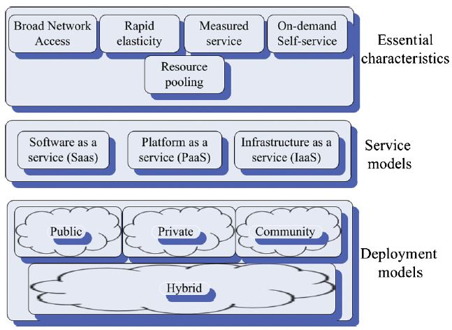
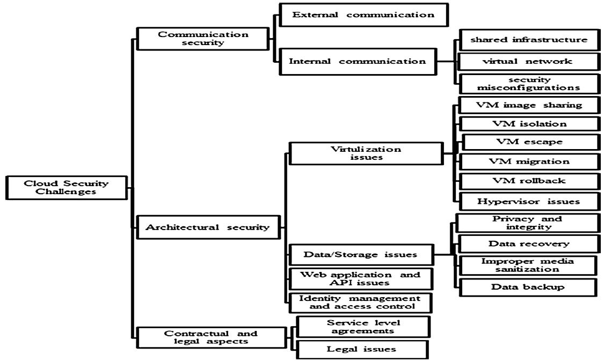
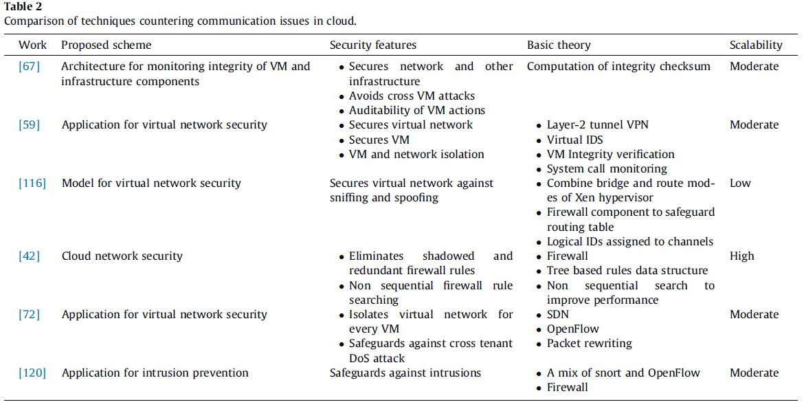

class: center, middle

# Security in cloud computing: Opportunities and challenges

### Mazhar Ali, Samee U. Khan, Athanasios V. Vasilakos
---

## Outline

### 1. 简介

### 2. 云计算架构框架

### 3. 云计算中的安全挑战

### 4. 应对方案

---

## 1 简介

- 由于一些特性(经济的、可伸缩的、方便的)，云计算在学术界和工业界都得到广泛应用。

- 云计算中采用了多种不同的技术，如web服务、虚拟化和多租户。这些技术本身存在一定安全隐患。

- 安全已经成为云计算广泛使用的障碍，一些企业和研究机构不能完全信任云计算，因为他们需要把他们的数字资产完全转移给第三方的云服务提供者。

- 已经有许多文献讨论了云计算中的安全问题。

- 这篇文章就是做一个综述，主要总结了云计算中各种可能出现的安全问题，以及文献中已经有的应对方案。

---

## 2 云计算架构框架

- NIST对云计算的定义：

---

## 2.1 云计算的必要特性

- 响应需求的自我服务：用户无需服务提供商介入即可需求和管理服务，提供的服务依据用户的服务要求。

- 广泛的网络访问能力：用户可以通过异质网络或不同环境访问云服务。

- 资源池化：资源的所在地对用户透明，相当于一个资源池，用户共享池中资源。

- 快速弹性：依据用户需求，资源可以快速伸缩。

- 可测量服务：服务的使用量将会被计量然后报告给服务提供商(CSP)，CSP据此进行收费。

- 多租户：一个资源被多个用户租用。NIST中没有定义此特性。

---

## 3 云计算中的安全挑战

- 可分为三类：通信安全、架构安全和契约与法律层面的安全。

---

## 3.1.1 通信安全：外部通信安全

- 与传统的网络服务遇到的问题相同：拒绝服务攻击、中间人攻击、窃听、ip欺骗和伪装。

- 解决方案：SSL、IPSec、加密算法、入侵检测和保护系统、数字证书等

---

## 3.1.2 通信安全：内部通信安全

- 共享通信基础设施：可实施跨租户的窗口攻击（the window of cross-tenant attack）。一些被赋予管理权限的用户，可能会恶意的利用物理通信设施（如网卡）实施攻击，比如窃听等。

- 虚拟网络：入侵检测和一些保护机制是基于流量模式和活动方式来判断和检测攻击的，而这些检测是针对物理网络实现的，在虚拟网络中可能会失效，从而让一些攻击可以实施，如拒绝服务攻击、针对虚拟网络的窃听。

- 安全配置错误：虚拟机、数据和应用的迁移、流量模式和拓扑结构的变化需要不同的安全策略，不同用户不同时候需要不同的安全配置。共享的物理网络若选择一种最常见的配置也未必能满足全部的安全性要求。

---

## 3.2.1 架构安全：虚拟化方面的问题

- 虚拟机镜像共享：恶意用户可以上传包含恶意代码或恶意软件的镜像到镜像库中。其他人若使用了这个镜像，则会使得虚拟机受到感染。

- 虚拟机隔离：尽管逻辑上实现了隔离，但对于同一个物理资源的访问可能导致数据外泄或穿越虚拟机的攻击。一些研究表明，内存和计算硬件若不隔离，也会有安全隐患。

- 虚拟机逃逸(escape)：恶意用户从虚拟机的监控器或hypervisor中逃逸出来，使得恶意用户能够访问其他虚拟机或使虚拟机控制器崩溃。

- 虚拟机迁移：迁移过程中，虚拟机中的内容是暴露在网络上的，并且虚拟机代码此时也是易受攻击的，这些都有安全隐患。此外，黑客有可能通过攻击迁移代码，将虚拟机迁移到一个自己控制的服务器上。

- 虚拟机回滚：回滚是虚拟机提供给用户一个方便的功能，但是回滚可能会使得一些保密的内容回复到未保密的状态、未打补丁的状态和策略与配置错误的状态，从而产生安全隐患。

- Hypervisor的问题：如果VMM被入侵了，则所有虚拟机会被黑客控制；虚拟机的metadata也会暴露给黑客；目前VMM中有许多报告的bug使得黑客可以控制VMM或者绕开安全限制。

- 虚拟机自主扩张(sprawl)：自主扩张意味着虚拟机数量在宿主机上持续增长并且大部分这些启动的虚拟机处于空闲状态，这种情况会耗尽宿主机的资源。

---

## 3.2.2 架构安全：数据/存储方面的问题

- 数据隐私性和完整性：一些研究表明，云计算模型中的数据保密性、完整性和可用性比传统计算模型更易受到攻击；一种成功的攻击可以使得黑客获得所有用户数据的非授权访问权限；SaaS提供商的员工，能够访问所有用户的数据这点也是个潜在的危险；其他用户正在处理的数据（处于共享存储中）是可以被恶意用户攻击的；云计算中，密码学的密钥生成和管理机制没有标准化，这个标准化的缺陷可能有潜在的风险。

- 数据恢复的脆弱性：分配给特定用户的资源可能会被再分配给另一个用户。若是存储资源，一个恶意用户可以从分配的存储资源中恢复前一个用户的数据。

- 不适当的媒介消毒(media sanitization)：物理的存储媒介有可能因为某些原因需要被销毁，这时如果处理不恰当，就会使得用户数据处于危险中。有时，多租户会加剧这个问题，若存储媒介还被一些租户使用，则不太可能对媒介进行销毁。

- 数据备份：常规的数据备份过程需要CSP的参与，以防止意外的灾难。此外，备份的数据需要保护以防止非授权的访问。

---

## 3.2.3 架构安全：Web应用和API安全

- 传统的Web应用安全问题在这个环境下也是适用的。

- 但是云计算环境下，涉及到多租户、他们的数据和不同的资源，使得问题更加复杂，传统的解决方案未必适用。

- 截止2013年统计的十大Web安全问题：注入攻击(SQL, OS, and LDAP)、破坏认证和会话管理、跨站脚本、直接引用非安全对象、安全配置错误、敏感数据暴露、功能级权限控制缺失、跨站请求伪造(CSRF)、使用已知的脆弱组件、失效重定向和转发

---

## 3.2.4 架构安全：身份管理与访问控制

- 用户和资源在不同的管理域中。

- 可能面对不同的鉴别和授权框架。

- 云计算中的弹性和动态性使得用户频繁的加入和退出云，传统的方法可能不适用。

- 需要动态、细粒度和严格的访问控制

- 弱的身份管理和访问控制会导致很多问题：如由于账户锁定的拒绝服务、XML包装攻击等。

---

## 3.3.1 契约与法律层面的安全：服务水平协议(SLA)

- SLA是一个用户和服务提供商之间关于服务水平的协议。

- 若对协议理解有分歧，则很难追究CSP的损失。

- 监控协议的执行：用户和CSP之间的统计差异。

- CSP提供的安全服务是难以审计(audit)的，比如很难判断云服务中租户间的逻辑隔离程度。若第三方审计，则会暴露用户数据。

---

## 3.3.2 契约与法律层面的安全：法律方面的问题

- CSP的资源可能分布在不同法律体系的国家和地区。

- 用户数据迁移到不同法律体系的地方时，很难修改安全策略来遵从新地区的法律体系。

- 数据可能会出现在不同的数字安全法的地方，从而如果发生争议，会出现关于哪些法律适用的管辖权问题。

- E-discovery：由于硬件扣押调查产生的数据泄露风险。

---

## 4 应对方案

- 此部分详细的介绍了针对以上问题的一些应对方法并对他们进行比较，如针对通信安全问题的：

