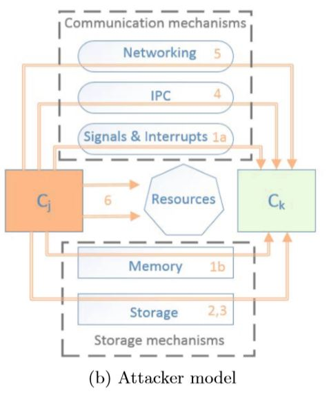
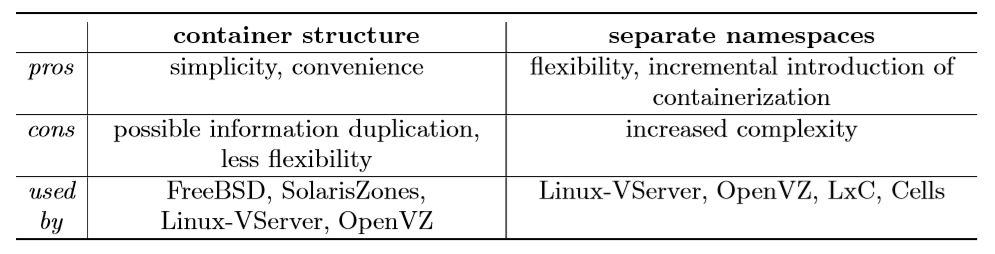
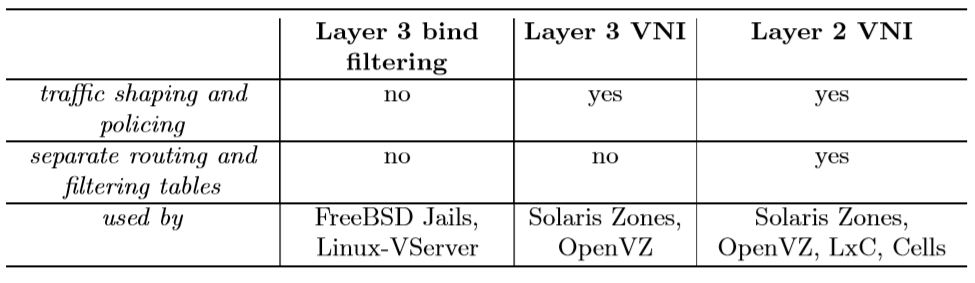
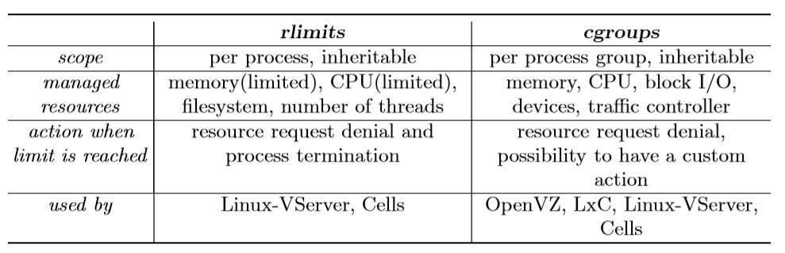
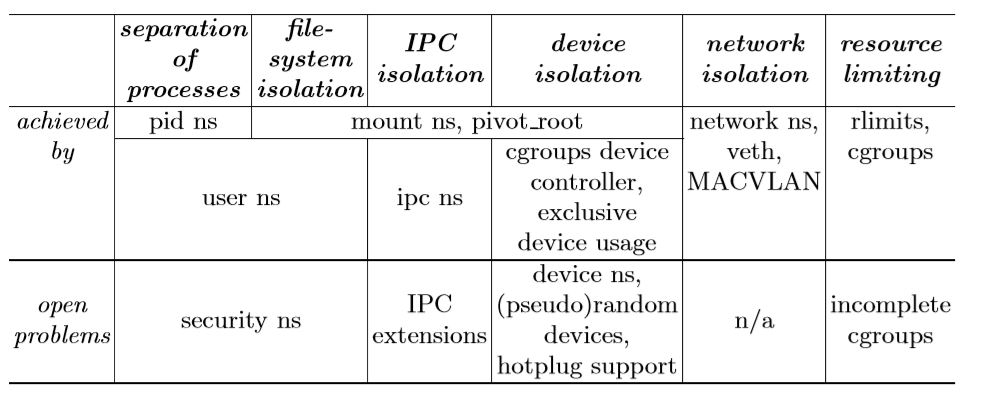

class: center, middle

# Security in cloud computing: Opportunities and challenges

### Mazhar Ali, Samee U. Khan, Athanasios V. Vasilakos
---

## Outline

### 1. 简介

### 2. 云计算架构框架

### 3. 云计算中的安全性挑战

### 4. 应对方案

---

## 1 简介

- 由于一些特性(经济的、可伸缩的、方便的)，云计算在学术界和工业界都得到广泛应用。

- 云计算中采用了多种不同的技术，如web服务、虚拟化和多租户。这些技术本身存在一定安全隐患。

- 安全已经成为云计算广泛使用的障碍，一些企业和研究机构不能完全信任云计算，因为他们需要把他们的数字资产完全转移给第三方的云服务提供者。

- 已经有许多文献讨论了云计算中的安全问题。

- 这篇文章就是做一个综述，主要总结了云计算中各种可能出现的安全问题，以及文献中已经有的应对方案。

---

## 2 云计算架构框架

- NIST对云计算的定义：

---

## 3.1 攻击者模型

- 两部分容器，一部分被攻击者入侵控制，另一部分被合法用户控制

---

## 3.2 攻击目的

- 破解容器：利用已控制的容器入侵合法用户的容器，攻击方式可以为非法数据获取、中间人攻击和影响合法容器的指令执行

- 拒绝服务：干扰合法用户容器的运行，耗尽合法用户容器所需资源

- 特权提升：获取一些本来已控制容器不具有的特权。

---

## 3.3 安全性要求

- 攻击大致通过两种机制实现：存储机制和通信机制

因此对容器的安全性有如下要求：

- 进程分离

- 文件系统隔离

- 设备隔离

- IPC隔离: IPC原语，如信号量、共享内存、消息队列

- 网络隔离

- 资源管理(限制)

---

## 4 安全性比较

### 4.1 进程分离

- 两种容器化方法：容器结构和分离名称空间（namespace）

- 容器结构：与进程数据结构连接上一个描述容器的结构体，如FreeBSD Jails, Solaris Zones, OpenVZ 和 Linux-VServer 

- 分离名称空间：名称空间是一个让进程成组的方法，这个方法控制成组的进程只能看到和通信同组的进程，如LXC

---

### 4.2 文件系统隔离

- chroot命令是不够安全的，它依赖于路径名解析，拥有特权的进程可以逃出这个限制。

- 只有Cells是单独依赖于chroot。有一些虚拟化技术使用Secure chroot barrier去阻止进程逃出可修改的空间

- LXC不止修改了容器中进程的根目录，还修改了根文件系统：可以将原文件系统的挂载点移到一个新文件系统的目录下，从而进行隔离。

- 能通过把用户和组id映射到一个低特权级别的用户和组id加强隔离 

---

### 4.3 设备隔离

3种设备是安全可让容器接触的：

- 完全的虚拟设备

- 无状态的设备

- 识别名称空间的设备

- 所有的容器技术都可以定义哪些设备可使用和限制创建新的设备节点

- Linux的物理设备是不能识别名称空间且不能在容器内安全使用的。

---

### 4.4 IPC隔离

- 限制进程通过IPC原语进行通信

- Unix是基于文件系统的IPC机制(domain sockets和named pipes)，因此如果文件系统隔离好了，IPC也隔离好了

- 另外的方法：IPC名称空间，允许创建完全不交的IPC集合。如Linux-VServer, OpenVZ, LxC and Cells

- Solaris Zones: 每个IPC对象关联一个zone ID，即关联某个zone，zone内的进程不能访问非关联的IPC对象

---

### 4.5 网络隔离

- 3种技术：bind filtering, Layer 3 VNI, Layer 2 VNI

- bind filtering:bind() 限制到特定的ip地址，实现网络时代码少，性能好，但网络功能受到限制，如DHCP、路由表无法使用

- Layer 3 VNI：3层网络虚拟接口，更弹性。

- Lyaer 2 VNI: 2层网络虚拟接口，支持更多功能，但性能差，不能从宿主机上控制容器内的网络启动。 VETH。

- LXC支持MACVLAN技术，可以让每个容器有自己的链路层地址。有不同的模式(private,bridge,VEPA)。

---

### 4.6 资源管理

- 大致分为rlimits和cgroups两种方法

- rlimits对CPU和内存的控制有限：不能设定相对共享CPU时间, 在内存里驻留的虚拟内存页数，物理CPU(physical CPU)和内存(memory bank)的分配。 

---

### 5 总结

